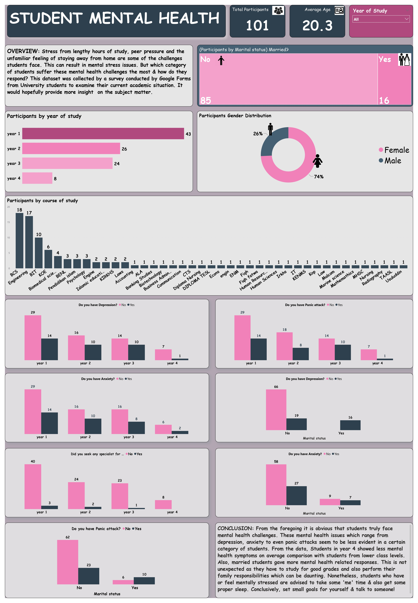

# STUDENT MENTAL HEALTH

## Introduction 
I got the dataset from Quantum Analytics NG as part of my internship programme. The idea behind this project was to understand Student mental health and the sort of mental health challenges they face. The dataset, a csv file, is a single table with 101 rows and 12 columns. It collected by a survey conducted by Google Forms from University students to examine their current academic situation. The pattern of responses were studied and valuable insights were generated using Power BI.

## Problem Statement
- What sort of mental Health challenges do students face
- What category of students suffer these challenges the most

## Data Transformation/Cleaning
Having loaded the data into the Power Query Editor in Power BI, I proceeded to transform and clean the data to ensure quality. Actions include:

- Removed duplicate records
- Checked column quality for possible null values
- Changed all data types to the appropriate type

## Data Modelling
Being a single table document, data modelling was not applicable.

## Visualization
A visual representation of the dataset was created using Power BI. The dashboard/report can be seen below.

For the interactive visual, you can check it out [Here](https://app.powerbi.com/groups/me/reports/212694ac-4aff-44c0-8aed-da373b767de9/ReportSection?experience=power-bi)

## Conclusion
In conclusion, the responses showed that students do truly face mental health challenges. The challenges which include depression, anxiety and panic attacks were more visible in a certain category of students. Students in Year 4 for instance, had less mental health challenges on average comparison to students in lower levels. Also, married students gave more mental health related responses. Worthy of note, is the fact that majority of these affected students did not seek the help of a trained specialist.

## Recommendations
- Seek the help of a Specialist
- Talk to someone
- Set small achievable goals
- set out some time for yourself to unwind
